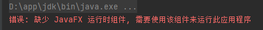
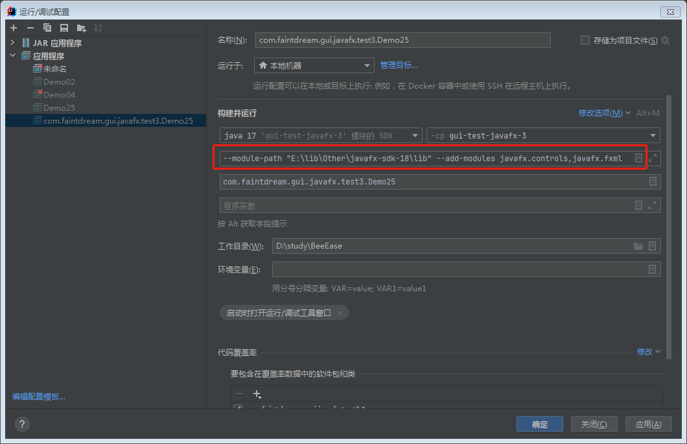

## 解决JavaFX报错缺少JavaFX 运行时组件, 需要使用该组件来运行此应用程序问题

### 概述(废话)
Java JDK 1.8以后，JavaFX 被从Java JDK中移除了，
因此我们使用 JavaFX 来进行开发时，如果我们使用的是1.8以后的版本，
需要引入JavaFX的依赖(使用Maven或者手动配置jar包);
Java JDK 1.8之后的JDK 9,引入了 模块化 这一概念,
在未启用java模块的情况下，JVM 是找不到JavaFX相关的依赖的;
所以即使我们引入了JavaFX的依赖jar包,
仍然会报错无法运行;
<!-- 空行 -->

<!-- 空行 -->
如何解决?根据我自己的研究和网上的一些资料,我总结出以下4种方法解决:
<!-- 空行 -->
### 方法1: 直接使用 Java JDK 1.8 进行开发
既然解决不了问题,那么久直接绕过,直接使用JDK 1.8进行开发;
看似逃避问题的方法,实则少走几十年弯路...

### 方法2: 使用模块化的方式引入JavaFX 的依赖

在项目(模块)的**根目录**下创建一个 "module-info.java" 的模块配置文件:
```java filename=module-info.java
module guiTestJavafx {
    
    // 依赖的模块
    requires javafx.controls;
    requires javafx.fxml;

    // 导出的包
    // exports com.faintdream.test1.gui.javafx;

    // 将指定的包打开给其他模块(javafx.fxml)访问
    opens com.faintdream.test1.gui.javafx to javafx.fxml;
}
```
上面的代码,声明了一个名为 guiTestJavafx 的模块,
并引入了 javafx.controls 和 javafx.fxml 这两个模块的依赖;<!-- 空行 -->
通过 exports 关键字将 "com.faintdream.test1.gui.javafx" 包导出,以使其他模块能够访问该包中的类
使用 opens 关键字将 "com.faintdream.test1.gui.javafx" 包开放给javafx.fxml包,
允许 JavaFX 访问该包中的资源
<!-- 空行 -->
**将 "com.faintdream.test1.gui.javafx" 
替换为JavaFX应用程序(javafx.application.Application)所在的包**

### 方法3: 配置VM参数
配置VM参数 来告诉java虚拟机 JavaFX在哪!
注意，这里配置的VM参数,不是程序实参
<!-- 空行 -->

<!-- 空行 -->

### 方法4: 奇奇怪怪的方法
不使用main方法调用launch()方法,
而是使用Junit单元测试的测试方法(@Test)来调用;
```java 
@Test
public void Test(){launch();}
```
原理未知,但是可以运行!个人猜测可能是Junit帮我们封装了模块;
如果要使用这种方法,记得引入Junit的依赖,
使用这种方法运行会在控制台输出以下警告(不影响运行):
<!-- 空行 -->
```
6月 13, 2023 4:13:08 下午 com.sun.javafx.application.PlatformImpl startup
警告: Unsupported JavaFX configuration: classes were loaded from 'unnamed module @573fd745'
```
以下是一个范例,记得引入Junit依赖;
```java 
package com.faintdream.test1.gui.javafx;

import javafx.application.Application;
import javafx.scene.Scene;
import javafx.scene.layout.VBox;
import javafx.stage.Stage;
import org.junit.Test;

public class Demo01 extends Application {

    @Override
    public void start(Stage stage) throws Exception {

        VBox vBox = new VBox();
        Scene scene = new Scene(vBox,600,400);
        stage.setScene(scene);
        stage.setTitle(getClass().getSimpleName());
        stage.show();
    }
    
    // 用Test方法代替main方法
    @Test
    public void launchTest(){
        launch();
    }
}
```